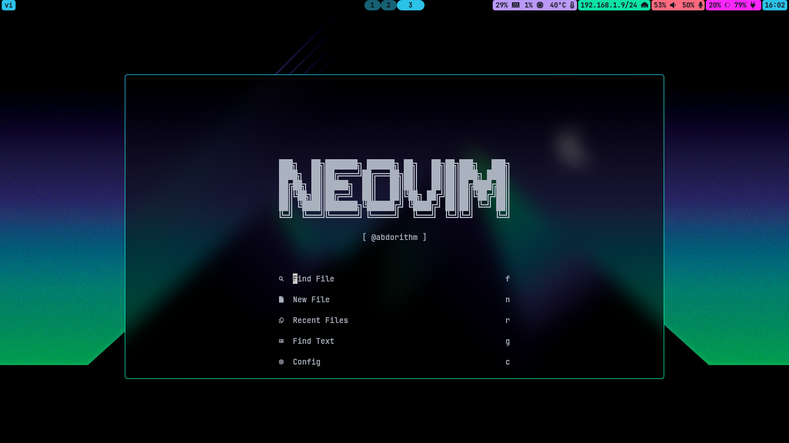

- My dotfiles on Arch Linux. Suckless (Xorg), Hyprland (Wayland) NeoVim (LazyVim), and more
- You may change the programs I use to your liking (e.g. change the brightness controller to `brightnessctl` instead of `light`)
- The fonts used are `CaskaydiaCode Nerd Font` and `JetBrainsMono Nerd Font`
- I will be adding screenshots and more information soon

## hyprland screenshots

