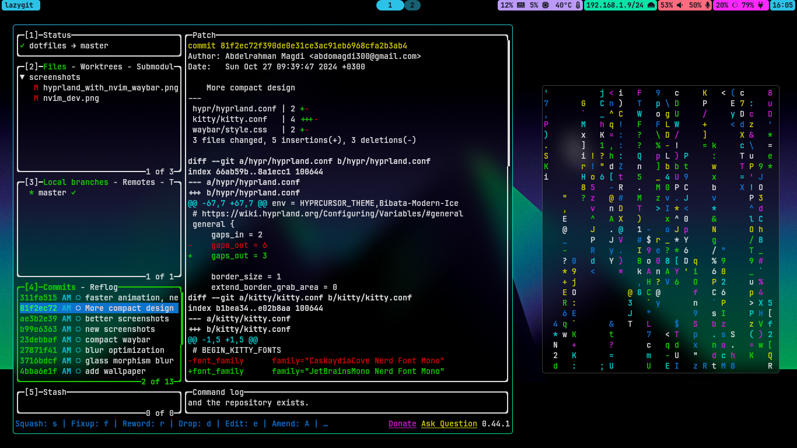

- My dotfiles on Arch Linux. Suckless (Xorg), Hyprland (Wayland) NeoVim (LazyVim), and more
- You may change the programs I use to your liking (e.g. change the brightness controller to `brightnessctl` instead of `light`)
- The font used is `JetBrainsMono Nerd Font`
- You may change the wallpaper path in `hypr/hyprpaper.conf` to your liking, I provided my wallpaper in [screenshots](screenshots/)
- I will be adding screenshots and more information soon

## hyprland screenshots

